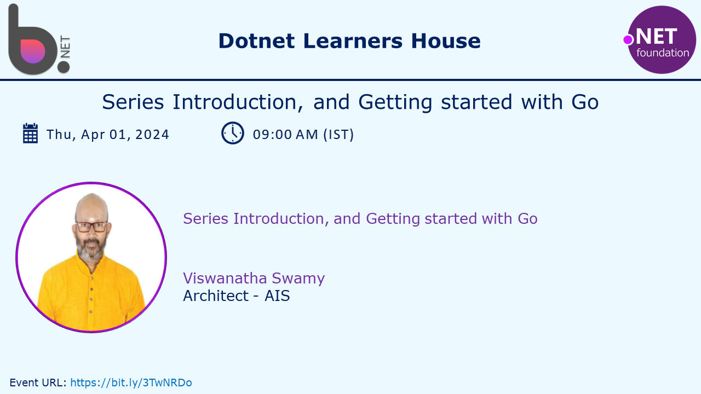
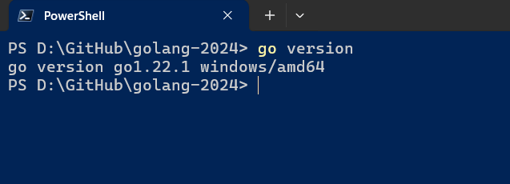
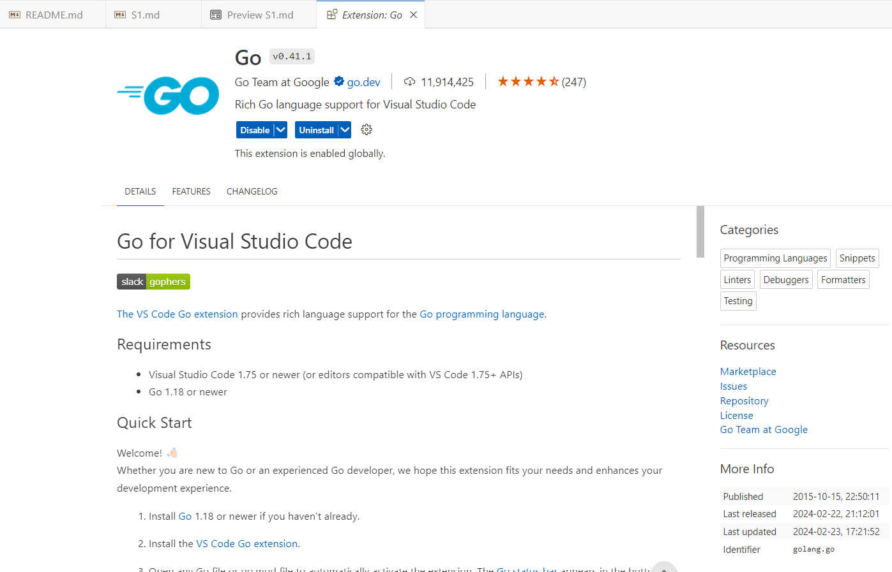
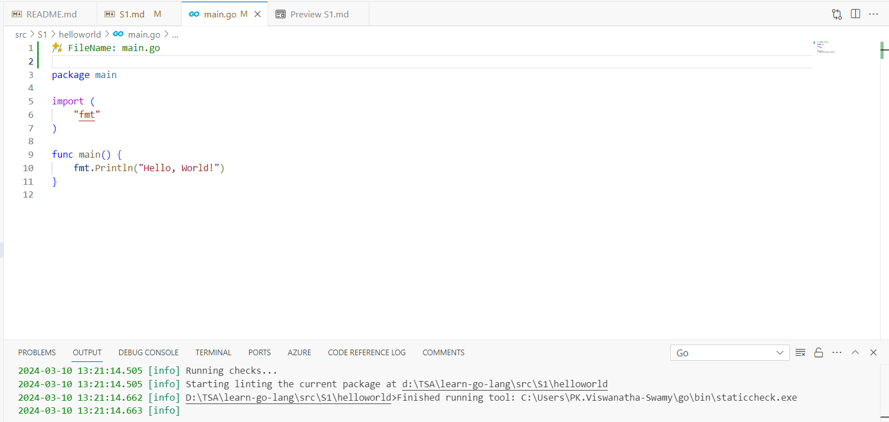
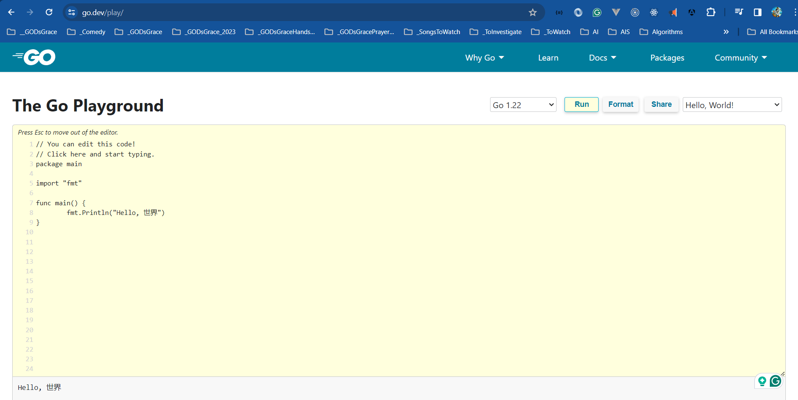

# `Session 1:` Series Introduction, and Getting started with Go

## Date Time: XX-Apr-2024 at 09:00 AM IST

## Event URL: <https://www.meetup.com/dot-net-learners-house-hyderabad/events/ToBeDone>

## YouTube URL: <https://www.youtube.com/watch?v=ToBeDone>

---

### Software/Tools

> 1. OS: Windows 10/11 x64
> 1. go lang
> 1. Visual Studio Code

### Prior Knowledge

> 1. 3-6 months Programming knowledge in C#/java

## Technology Stack

> 1. go lang

## Information

## What are we doing today?

> 1. Series Introduction
> 1. `go` installation
> 1. Install `golang.go` extension in VS code
> 1. Install/Update `go tools` in VS Code
> 1. Discussion on couple of go tools
>    - `staticcheck`
>    - `goplay`
> 1. SUMMARY / RECAP / Q&A

### Please refer to the [**Source Code TOBEDONE**](https://github.com/ViswanathaSwamy-PK-TechSkillz-Academy/minimal-apis) of today's session for more details

---

---

## Series Introduction

> 1. Noob to Nerd in Go Lang
> 1. Nerd to Novice in Go Lang
> 1. Novice to Beginner in Go Lang
> 1. Beginner in Go Lang
> 1. Beginner Level 1 - Building CLI Applications
> 1. Beginner Level 2 - Building Web APIs
> 1. Beginner Level 3 - Building Web Applications
> 1. Beginner Level 4 - Building gRPC Services
> 1. Beginner Intermediate - Building Full Stack Applications
> 1. Beginner Intermediate - Building Microservices

## `go` installation

> 1. Discussion and Demo
> 1. <https://go.dev/doc/install>

## Install `golang.go` extension in VS code

> 1. Discussion and Demo

## Install/Update `go tools` in VS Code

> 1. Discussion and Demo
> 1. `gopls:` Pronounced as “Go please,” it’s the official Go language server developed by the Go team. It provides IDE features to any LSP-compatible editor. You don’t need to interact with gopls directly; it will be automatically integrated into your editor. Features and settings vary slightly by editor, so refer to your editor’s documentation for specifics.
> 1. `staticcheck:` A static analysis tool that identifies potential issues in your Go code. It catches common mistakes, inefficiencies, and style violations.
> 1. `goplay:` An online Go playground where you can experiment with Go code snippets. Great for sharing and collaborating.
> 1. `gotests:` Generates test functions for your Go code. It’s useful for maintaining test coverage and ensuring code correctness.
> 1. `impl:` Automatically generates method stubs for Go interfaces. Handy for implementing interface methods quickly.
> 1. `dlv:` A powerful debugger for Go. It helps you inspect variables, set breakpoints, and step through code during debugging sessions.
> 1. `gomodifytags:` Allows you to add, modify, or remove struct field tags in your Go code. Useful for managing serialization, validation, and other metadata.

## Discussion on couple of `go tools`

> 1. Discussion and Demo

### `staticcheck`

> 1. Discussion and Demo

### `goplay`

> 1. Discussion and Demo

## Few `go` commands

> 1. Discussion and Demo

### `go mod init`

> 1. The go mod init command initializes a new Go module in the current directory. It creates a go.mod file that specifies the module’s properties and dependencies. This file includes information about the Go version and other modules required by your code. By using go mod init, you set up a module that others can import and use, making it easier to manage dependencies and versioning for your Go project

### `go run .`

> 1. The go run . command compiles and executes the Go program in the current directory. It automatically detects and runs the main package, making it convenient for testing or running small Go applications without explicitly building an executable binary .

## Packages

> 1. Discussion and Demo

## Imports

> 1. Discussion and Demo

## Exported names

> 1. Discussion and Demo

## Go executable path

> 1. Discussion and Demo

## Go Backward compatability

> 1. Discussion and Demo
