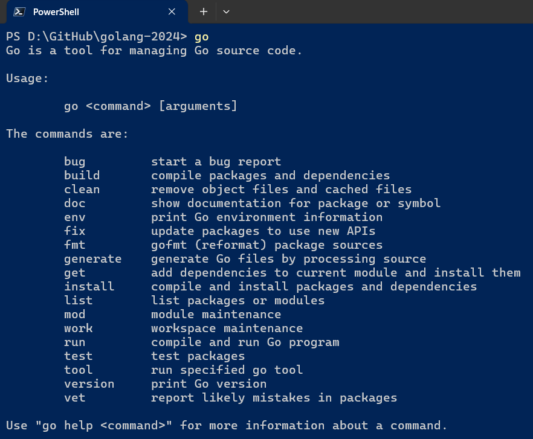
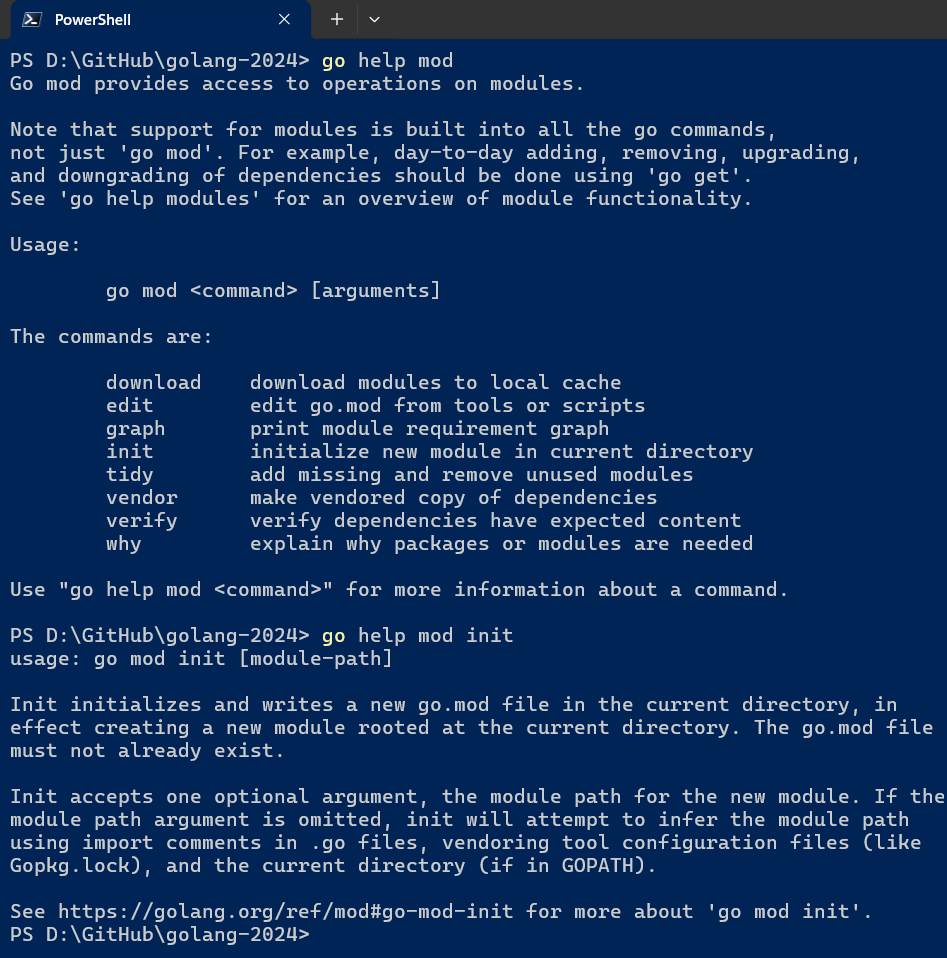
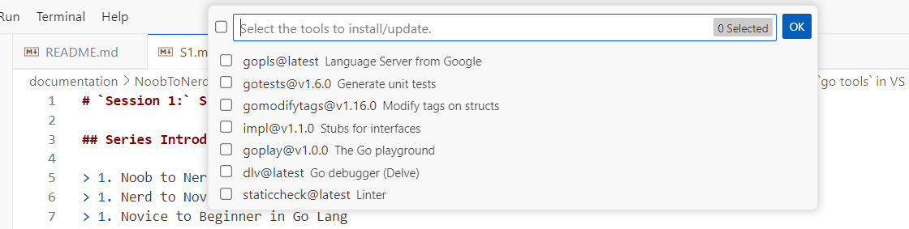
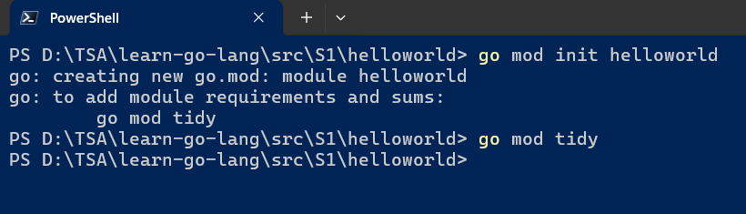
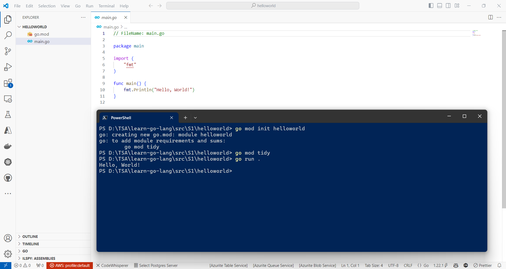
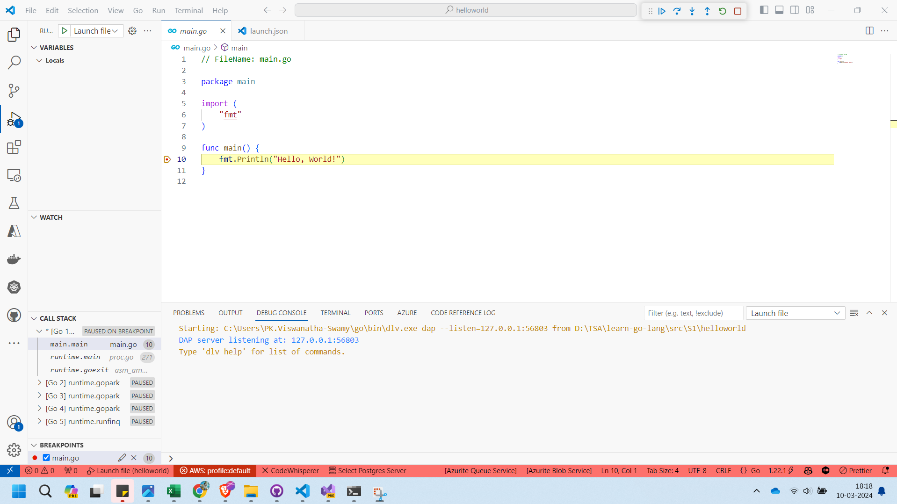

# `Session 1:` Series Introduction, and Getting started with `Go`

## Date Time: XX-Apr-2024 at 09:00 AM IST

## Event URL: <https://www.meetup.com/dot-net-learners-house-hyderabad/events/ToBeDone>

## YouTube URL: <https://www.youtube.com/watch?v=ToBeDone>


---

### Software/Tools

> 1. OS: Windows 10/11 x64
> 1. `Go` lang
> 1. Visual Studio Code

### Prior Knowledge

> 1. 3-6 months Programming knowledge in C#/java

## Technology Stack

> 1. `Go` lang

## Information


## What are we doing today?

> 1. The Big Picture
>    - Previous Session(s)
> 1. Series Introduction
> 1. What is `Go`?
> 1. The `Go` Playground
> 1. `Go` installation
>    - Verifying `Go` version
>    - Retrieving available `Go` commands
>    - Getting Help on `Go` Commands
> 1. Install `VS Code`, and `golang.go` VS code extension
> 1. Install/Update `Go tools` in VS Code
> 1. Discussion on couple of `Go tools`
>    - `gopls`
>    - `staticcheck`
>    - `goplay`
> 1. Few `Go` commands
>    - `go mod init`
>    - `go run .`
> 1. Let's `Go` with our first `Go` program
>    - Create a `Go` module inside `helloworld` folder
>    - Create a main.go file, to contain the code
>    - Quick Code Walk through
>    - Executing the `Go` code i.e., main.go file
>    - Create a go.mod and main.go file, inside another folder `helloworldv1`
>    - Executing the `Go` code
>    - Few ways to execute `Go` code
> 1. SUMMARY / RECAP / Q&A

### Please refer to the [**Source Code**](https://github.com/ViswanathaSwamy-PK-TechSkillz-Academy/learn-go-lang/tree/main/src/S1) of today's session for more details

---


---

## 1. The Big Picture

> 1. Discussion and Demo

### Previous Session(s)

> 1. N/A

## 2. Series Introduction

> 1. Noob to Nerd in `Go` Lang
> 1. Nerd to Novice in `Go` Lang
> 1. Novice to Beginner in `Go` Lang
> 1. Beginner in `Go` Lang
> 1. Beginner Level 1 - Building CLI Applications using `Go`
> 1. Beginner Level 2 - Building Web APIs using `Go`
> 1. Beginner Level 3 - Building Web Applications using `Go`
> 1. Beginner Level 4 - Building gRPC Services using `Go`
> 1. Beginner Intermediate - Building Full Stack Applications using `Go`
> 1. Beginner Intermediate - Building Microservices using `Go`

## 3. What is `Go`?

> 1. Discussion and Demo
> 1. <https://go.dev/>
> 1. <https://en.wikipedia.org/wiki/Go_(programming_language)>

## 4. The `Go` Playground

> 1. Discussion and Demo
> 1. <https://go.dev/>


## 5. `Go` installation

> 1. Discussion and Demo
> 1. <https://go.dev/doc/install>

### Verifying `Go` version

```powershell
go version
```


### Retrieving available `Go` commands

```powershell
go
```



### Getting Help on `Go` Commands

```powershell
go help mod

go help mod init
```



## 6. Install `VS Code`, and `golang.go` VS code extension

> 1. Discussion and Demo


## 7. Install/Update `Go tools` in VS Code

```powershell
Go: Install/Update Tools
```

> 1. Discussion and Demo
> 1. `gopls:` Pronounced as “Go please,” it’s the official Go language server developed by the Go team. It provides IDE features to any LSP-compatible editor. You don’t need to interact with gopls directly; it will be automatically integrated into your editor. Features and settings vary slightly by editor, so refer to your editor’s documentation for specifics.
> 1. `staticcheck:` A static analysis tool that identifies potential issues in your Go code. It catches common mistakes, inefficiencies, and style violations.
> 1. `goplay:` An online Go playground where you can experiment with Go code snippets. Great for sharing and collaborating.
> 1. `gotests:` Generates test functions for your Go code. It’s useful for maintaining test coverage and ensuring code correctness.
> 1. `impl:` Automatically generates method stubs for Go interfaces. Handy for implementing interface methods quickly.
> 1. `dlv:` A powerful debugger for Go. It helps you inspect variables, set breakpoints, and step through code during debugging sessions.
> 1. `gomodifytags:` Allows you to add, modify, or remove struct field tags in your Go code. Useful for managing serialization, validation, and other metadata.



## 8. Discussion on couple of `Go tools`

> 1. Discussion and Demo

### `gopls`

> 1. Discussion and Demo

### `staticcheck`

> 1. Discussion and Demo


### `goplay`

> 1. Discussion and Demo


## 9. Few `Go` commands

> 1. Discussion and Demo

### `go mod init`

> 1. The go mod init command initializes a new Go module in the current directory. It creates a go.mod file that specifies the module’s properties and dependencies. This file includes information about the Go version and other modules required by your code. By using go mod init, you set up a module that others can import and use, making it easier to manage dependencies and versioning for your Go project

### `go run .`

> 1. The go run . command compiles and executes the Go program in the current directory. It automatically detects and runs the main package, making it convenient for testing or running small Go applications without explicitly building an executable binary .

## 10. Let's `Go` with our first `Go` program

> 1. Discussion and Demo

### Create a `Go` module inside `helloworld` folder

> 1. Discussion and Demo

```powershell
go mod init helloworld

go mod tidy
```



### Create a `main.go` file, to contain the code

> 1. Discussion and Demo
> 1. Methods `Built-in` VS from `package`

```go
// FileName: main.go

package main

func main() {
 println("Hello, Go Lang World!")
}
```

### Quick Code Walk through

> 1. Discussion and Demo

#### Packages

> 1. Discussion and Demo
> 1. A package is essentially a named collection of related Go source files. Each Go source file belongs to a specific package.

#### `main` function

> 1. Discussion and Demo
> 1. The main() function is mandatory in any Go executable program. It serves as the starting point for your program when it runs.
> 1. It takes no arguments and returns nothing. Go automatically calls the main() function, so you don’t need to invoke it explicitly.
> 1. Every executable program must have a single main package containing the main() function.

### Executing the `Go` code i.e., `main.go` file

> 1. Discussion and Demo

```powershell
go run .
```

### Create a `go.mod` and `main.go` file, inside another folder `helloworldv1`

> 1. Discussion and Demo

```powershell
go mod init helloworldv1
```

```go
// FileName: main.go

package main

import (
 "fmt"
)

func main() {
 fmt.Println("Hello, Go Lang World!")
}
```

#### Imports

> 1. Discussion and Demo
> 1. <https://pkg.go.dev/std>
> 1. <https://pkg.go.dev/fmt@go1.22.1>

#### Exported names

> 1. Discussion and Demo

### Executing the `Go` code

> 1. Discussion and Demo

```powershell
go run .
```

### Few ways to execute `Go` code

#### External `Terminal`

> 1. Discussion and Demo



#### Internal `Terminal` inside VS Code

> 1. Discussion and Demo


#### `Run and Debug` inside VS Code

> 1. Discussion and Demo



---

## X. SUMMARY / RECAP / Q&A

> 1. SUMMARY / RECAP / Q&A
> 2. Any open queries, I will get back through meetup chat/twitter.

---
