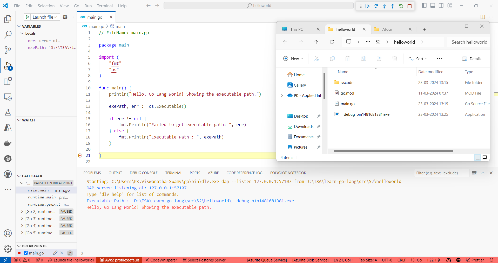
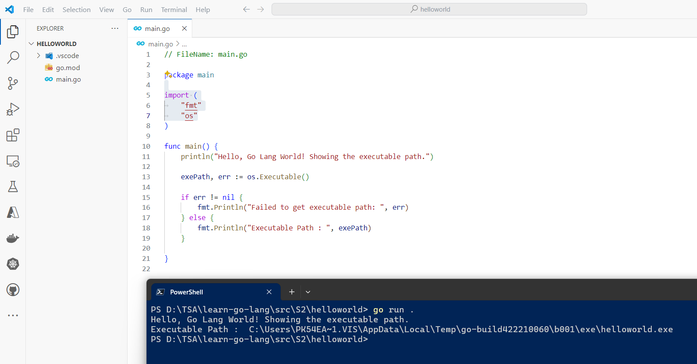
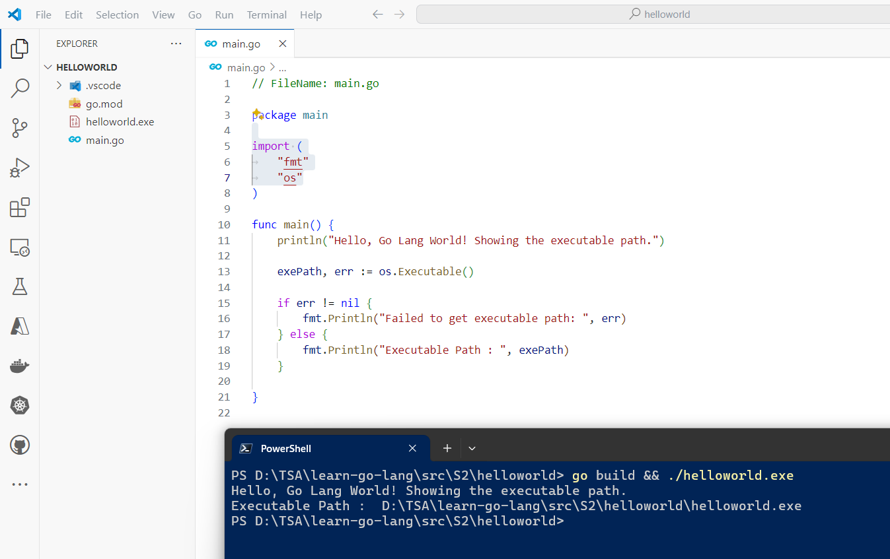
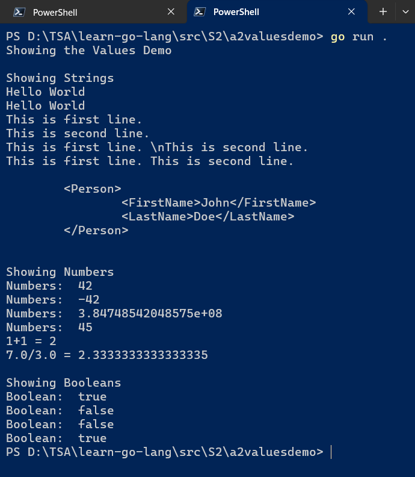
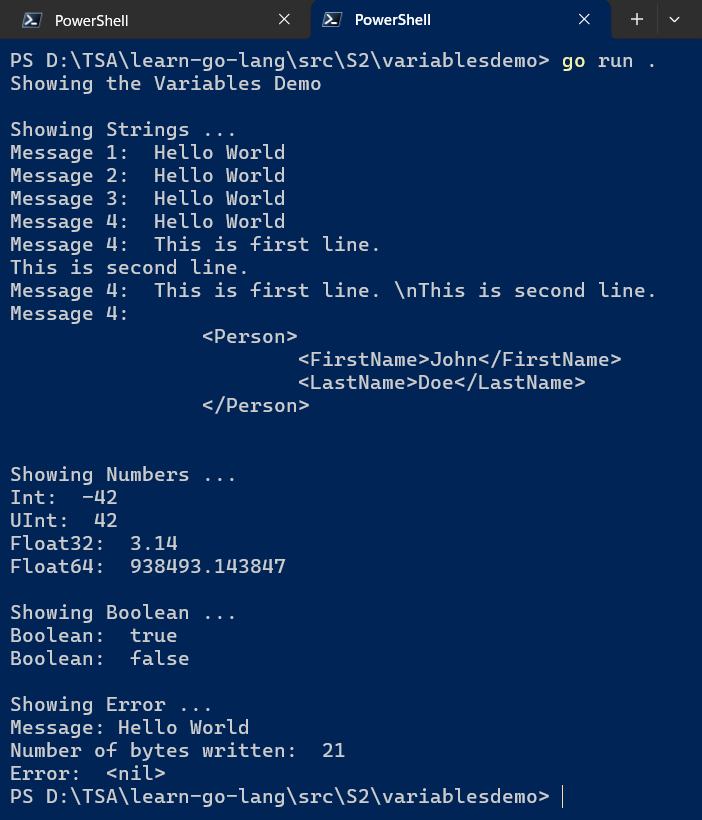

# `Session 2:` Working with Values, Basic Types, Variables, and Constants in `Go`

## Date Time: XX-Apr-2024 at 09:00 AM IST

## Event URL: <https://www.meetup.com/dot-net-learners-house-hyderabad/events/300050065>

## YouTube URL: <https://www.youtube.com/watch?v=ToBeDone>

<!--  -->

---

### Software/Tools

> 1. OS: Windows 10/11 x64
> 1. `Go` lang
> 1. Visual Studio Code

### Prior Knowledge

> 1. 3-6 months Programming knowledge in C#/java

## Technology Stack

> 1. `Go` lang

## Information


## What are we doing today?

> 1. [The Big Picture](#1-the-big-picture)
>    - [Previous Session(s)](#previous-sessions)
> 1. [`Go` tool chain](#2-go-tool-chain)
> 1. [Single Binary](#3-single-binary)
>    - [`.exe` location when executing from `VS Code`](#exe-location-when-executing-from-vs-code)
>    - [`.exe` location when executing using `go run`](#exe-location-when-executing-using-go-run)
>    - [`.exe` location when executing using `go build`](#exe-location-when-executing-using-go-build)
> 1. Values Demo
>    - Strings | Numbers | Booleans
> 1. Escape sequences
> 1. Basic Types
>    - string | int | uinit | float32 | float64 | bool | error
>    - <https://pkg.go.dev/builtin#error>
> 1. Variables
>    - Zero values
>    - Variables with initializers
>    - Short variable declarations
> 1. Type Conversions
> 1. Arithmetic <https://go.dev/ref/spec#Arithmetic_operators>
> 1. Comparison Operators <https://go.dev/ref/spec#Comparison_operators>
> 1. Constants, Constant Expression
> 1. SUMMARY / RECAP / Q&A

### Please refer to the [**Source Code**](https://github.com/ViswanathaSwamy-PK-TechSkillz-Academy/learn-go-lang/tree/main/src/S2) of today's session for more details

---


---

## 1. The Big Picture

> 1. Discussion and Demo

### Previous Session(s)

> 1. <https://www.youtube.com/watch?v=g9_FnDjHUTc>

## 2. `Go` tool chain

> 1. Discussion and Demo

## 3. Single Binary

> 1. Discussion and Demo
> 1. `.exe` location when executing from `VS Code`
> 1. `.exe` location when executing using `go run`
> 1. `.exe` location when executing using `go build`

### `.exe` location when executing from `VS Code`



### `.exe` location when executing using `go run`

```powershell
go run .
```



### `.exe` location when executing using `go build`

```powershell
go build && ./helloworld.exe
```



## X. Values Demo

> 1. Discussion and Demo
> 1. string | int | bool



## X. Basic Types

> 1. Discussion and Demo
> 1. <https://pkg.go.dev/builtin>
> 1. string
> 1. int | uinit | float32 | float64
> 1. bool
> 1. [error](https://pkg.go.dev/builtin#error) (We will just introduce, but will revisit later)

## X. Variables

> 1. Discussion and Demo
> 1. <https://pkg.go.dev/builtin>
> 1. Zero values
> 1. Variables with initializers
> 1. Short variable declarations



## X. Constants

> 1. Discussion and Demo
> 1. character | string | boolean | numeric

---

## X. SUMMARY / RECAP / Q&A

> 1. SUMMARY / RECAP / Q&A
> 2. Any open queries, I will get back through meetup chat/twitter.

---
