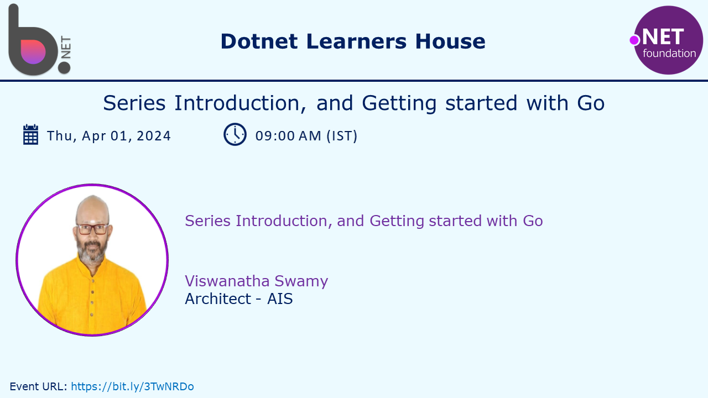

# `Session 2:` Working with Values, Variables, Basic Types, and Constants in `Go`

## Date Time: XX-Apr-2024 at 09:00 AM IST

## Event URL: <https://www.meetup.com/dot-net-learners-house-hyderabad/events/ToBeDone>

## YouTube URL: <https://www.youtube.com/watch?v=ToBeDone>



---

### Software/Tools

> 1. OS: Windows 10/11 x64
> 1. `Go` lang
> 1. Visual Studio Code

### Prior Knowledge

> 1. 3-6 months Programming knowledge in C#/java

## Technology Stack

> 1. `Go` lang

## Information


## What are we doing today?

> 1. To be done
> 1. SUMMARY / RECAP / Q&A

### Please refer to the [**Source Code TOBEDONE**](https://github.com/ViswanathaSwamy-PK-TechSkillz-Academy/minimal-apis) of today's session for more details

---


---

## X. The Big Picture

> 1. Discussion and Demo

### Previous Session(s)

> 1. N/A

## X. `Go` tool chain

> 1. Discussion and Demo

## X. Single Binary

```powershell
go run .
go build && ./hello.exe
```

> 1. Discussion and Demo
> 1. `.exe` Temporary Location
> 1. `go build`


## X. Values

> 1. Discussion and Demo

## X. Variables

> 1. Discussion and Demo
> 1. Zero values
> 1. Variables with initializers
> 1. Short variable declarations

## X. Basic Types

> 1. Discussion and Demo
> 1. bool
> 1. string
> 1. int | int8 | int16 | int32 | int64
> 1. uint | uint8 | uint16 | uint32 | uint64 | uintptr
> 1. byte // alias for uint8
> 1. rune // alias for int32 // represents a Unicode code point
> 1. float32 float64
> 1. complex64 complex128

## X. Constants

> 1. Discussion and Demo
> 1. character | string | boolean | numeric

---

## X. SUMMARY / RECAP / Q&A

> 1. SUMMARY / RECAP / Q&A
> 2. Any open queries, I will get back through meetup chat/twitter.

---
