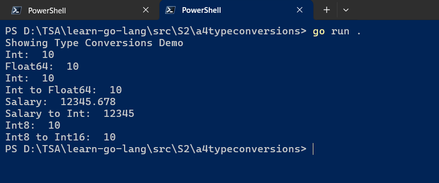
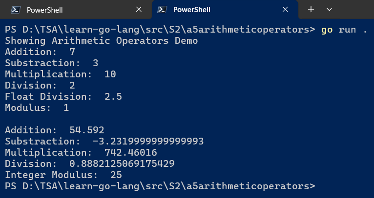
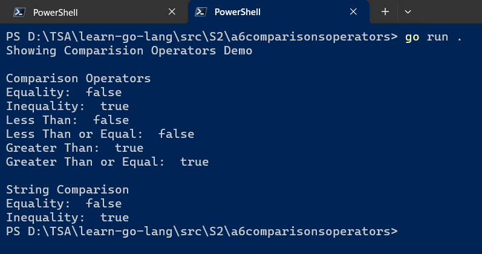

# `Session 2:` Working with Values, Basic Types, Variables, and Constants in `Go`

## Date Time: XX-Apr-2024 at 09:00 AM IST

## Event URL: <https://www.meetup.com/dot-net-learners-house-hyderabad/events/300050065>

## YouTube URL: <https://www.youtube.com/watch?v=ToBeDone>

<!--  -->

---

### Software/Tools

> 1. OS: Windows 10/11 x64
> 1. `Go` lang
> 1. Visual Studio Code

### Prior Knowledge

> 1. 3-6 months Programming knowledge in C#/java

## Technology Stack

> 1. `Go` lang

## Information


## What are we doing today?

> 1. [The Big Picture](#1-the-big-picture)
>    - [Previous Session(s)](#previous-sessions)
> 1. [`Go` tool chain](#2-go-tool-chain)
> 1. [Single Binary](#3-single-binary)
>    - [`.exe` location when executing from `VS Code`](#exe-location-when-executing-from-vs-code)
>    - [`.exe` location when executing using `go run`](#exe-location-when-executing-using-go-run)
>    - [`.exe` location when executing using `go build`](#exe-location-when-executing-using-go-build)
> 1. [Values Demo](#4-values-demo)
> 1. [Escape sequences](#5-escape-sequences)
> 1. [Basic Types](#6-basic-types)
> 1. [Variables](#7-variables)
> 1. [Type Conversions](#8-type-conversions)
> 1. [Arithmetic](#9-arithmetic-operators)
> 1. [Comparison Operators](#10-comparison-operators)
> 1. [Constants, Constant Expression](#11-constants-and-constant-expression)
> 1. [SUMMARY / RECAP / Q&A](#x-summary--recap--qa)

### Please refer to the [**Source Code**](https://github.com/ViswanathaSwamy-PK-TechSkillz-Academy/learn-go-lang/tree/main/src/S2) of today's session for more details

---


---

## 1. The Big Picture

> 1. Discussion and Demo

### Previous Session(s)

> 1. <https://www.youtube.com/watch?v=g9_FnDjHUTc>

## 2. `Go` tool chain

> 1. Discussion and Demo

## 3. Single Binary

> 1. Discussion and Demo
> 1. `.exe` location when executing from `VS Code`
> 1. `.exe` location when executing using `go run`
> 1. `.exe` location when executing using `go build`

### `.exe` location when executing from `VS Code`


### `.exe` location when executing using `go run`

```powershell
go run .
```


### `.exe` location when executing using `go build`

```powershell
go build && ./helloworld.exe
```


## 4. Values Demo

> 1. Discussion and Demo
> 1. Strings | Numbers | Booleans


## 5. Escape sequences

> 1. Discussion and Demo
> 1. Escape sequences in Go are special sequences of characters prefixed with a backslash `(\\)` that represent non-printable or special characters, such as newline `(\n)` or tab `(\t)`. They are commonly used in strings to represent characters that cannot be directly typed.

## 6. Basic Types

> 1. Discussion and Demo
> 1. <https://pkg.go.dev/builtin>
> 1. string
> 1. int | uinit | float32 | float64
> 1. bool
> 1. [error](https://pkg.go.dev/builtin#error) (We will just introduce, but will revisit later)

## 7. Variables

> 1. Discussion and Demo
> 1. <https://pkg.go.dev/builtin>
> 1. Unused variables are compile time error in `Go`
> 1. Zero values
> 1. Variables with initializers
> 1. Short variable declarations


## 8. Type Conversions

> 1. Discussion and Demo



## 9. Arithmetic Operators

> 1. Discussion and Demo
> 1. <https://go.dev/ref/spec#Arithmetic_operators>



## 10. Comparison Operators

> 1. Discussion and Demo
> 1. <https://go.dev/ref/spec#Comparison_operators>



## 11. Constants, and Constant Expression

> 1. Discussion and Demo
> 1. character | string | boolean | numeric

---

## X. SUMMARY / RECAP / Q&A

> 1. SUMMARY / RECAP / Q&A
> 2. Any open queries, I will get back through meetup chat/twitter.

---
