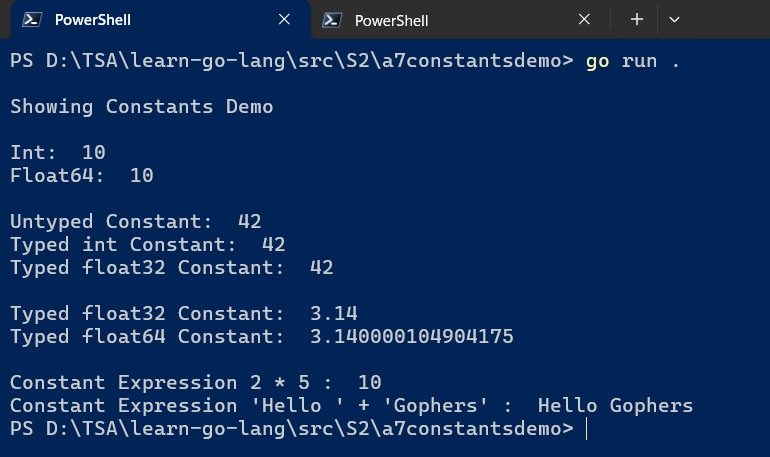

# `Session 3:` Working with Basic Types Part II, Functions, Constant Groups, Iota, Pointers in `Go`

## Date Time: XX-XXX-2024 at 09:00 AM IST

## Event URL: <https://www.meetup.com/dot-net-learners-house-hyderabad/events/300050065>

## YouTube URL: <https://www.youtube.com/watch?v=ToBeDone>

---

### Software/Tools

> 1. OS: Windows 10/11 x64
> 1. `Go` lang
> 1. Visual Studio Code

### Prior Knowledge

> 1. 3-6 months Programming knowledge in C#/java

## Technology Stack

> 1. `Go` lang

## Information

## What are we doing today?

> 1. [The Big Picture](#1-the-big-picture)
>    - [Previous Session(s)](#previous-sessions)
> 1. Functions which accepts nothing and returns nothing
> 1. Basic Types Part II
> 1. rune, and characters
> 1. Pointers
> 1. Constant Groups and Iota
> 1. [SUMMARY / RECAP / Q&A](#x-summary--recap--qa)

### Please refer to the [**Source Code**](https://github.com/ViswanathaSwamy-PK-TechSkillz-Academy/learn-go-lang/tree/main/src/S3) of today's session for more details

---

---

## 1. The Big Picture

> 1. Discussion and Demo

### Previous Session(s)

> 1. <https://www.youtube.com/watch?v=g9_FnDjHUTc>

## 2. Basic Types Part II

> 1. Discussion and Demo

---

## X. SUMMARY / RECAP / Q&A

> 1. SUMMARY / RECAP / Q&A
> 2. Any open queries, I will get back through meetup chat/twitter.

---
