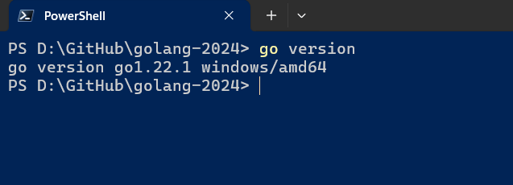

# `Session 1:` Series Introduction, and Getting started with Go

## Series Introduction

> 1. Noob to Nerd in Go Lang
> 1. Nerd to Novice in Go Lang
> 1. Novice to Beginner in Go Lang
> 1. Beginner in Go Lang
> 1. Beginner Level 1 - Building CLI Applications
> 1. Beginner Level 2 - Building Web APIs
> 1. Beginner Level 3 - Building Web Applications
> 1. Beginner Level 4 - Building gRPC Services
> 1. Beginner Intermediate - Building Full Stack Applications
> 1. Beginner Intermediate - Building Microservices

## go installation

> 1. Discussion and Demo
> 1. <https://go.dev/doc/install>

## Install `golang.go` extension in VS code

> 1. Discussion and Demo

## Install/Update `go tools` in VS Code

> 1. Discussion and Demo
> 1. gopls | gotests | gomodifytags | impl | goplay | dlv | staticcheck

## go work init

> 1. Discussion and Demo

## go mod init f5sorting

> 1. Discussion and Demo

## go work use

> 1. Discussion and Demo

## Packages

> 1. Discussion and Demo

## Imports

> 1. Discussion and Demo

## Exported names

> 1. Discussion and Demo

## Go executable path

> 1. Discussion and Demo

## Go Backward compatability

> 1. Discussion and Demo
